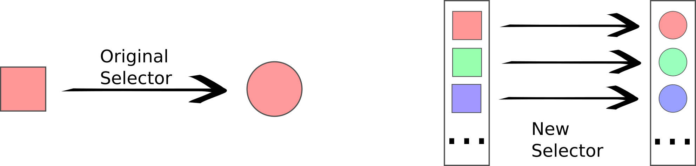
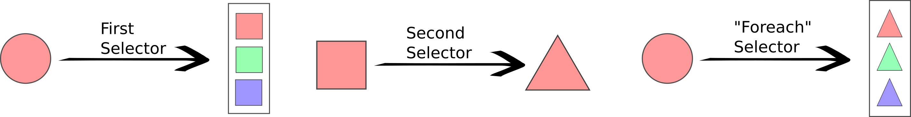
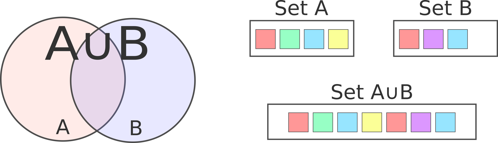
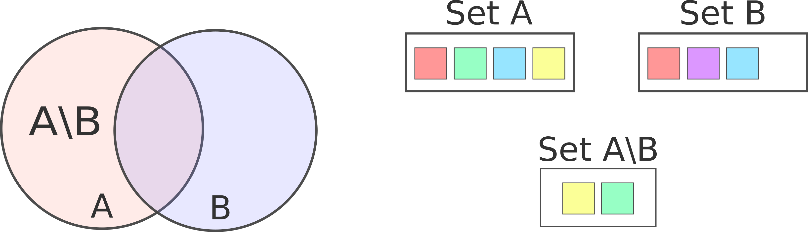

# Selector operations

## Inner Operations  

### Composition 

intuitively, to compose two or more selector functions is to apply them sequentially. In order to make composition feasible intermediate selector input and output signatures must completely match. Following the standard notation, function composition is processed starting from the rightmost function, that is, the last function is the first to be applied.

Therefore, the composed selector will have the same input signature as the rightmost selector and the output signature of the leftmost selector.

**Function signature:** `compose_selector(const F1& f1, const F2& f2, Funcs... fns`

### Single Output to Set

This operator converts any single-output selector into a set-output selector. Given a single-output selector creates a new one with the same input signature that outputs a set of size 1.

This operator is handy when you want to use other operators (e.g. set operators) that require the output to be a set without rewriting the selector.

**Function signature:** `selector_out_single_to_set(const F& f)`

### Single Input to Set 

This operator takes a single-input selector and creates a set-input selector. The new selector just applies the original selector to each element of the input set and joins the output using the [Union set operator](#union). Please note that all selectors created using this operator are set-input set-ouput selectors.

**Function signature:** `selector_in_single_to_set(const F& f)`

### Combined Foreach  

The combined foreach operator applies the second selector to each one of the elements selected by the first selector. There are some obvious restrictions over the types and cardinality of both selectors in order to apply this operator:

- The first operator output must be a **set**
- The second operator input must be a **single element**
- Output - Input types must **match**

The resultant selector will have the input signature of the first selector and it will output a set of the same type as the second selector. The output set is constructed by joining all single outputs using the [Union set operator](#union).

**Function signature:** `selector_foreach(const F1& f1, const F2& f2)`

---

## Set Operations  

Set operations combine the selected set of two selector functions, creating a new operator to perform that selection. In order to do so, they impose two restrictions for both selectors involved:

- They have the **same input type** and cardinality
- They both output a **set** of the **same type**

The result selector, as expected, will have this same signature. Set operations are implemented in `selector/selector_set_operations.h` and they belong to the namespace `neurostr::selector`.

### Union

The union operator takes two or more selectors that output sets and joins them creating a new set with the elements of each one of the original sets. Please note that the union might contain duplicated entities. You can delete copies by composing the resultant selector with the [Unique filter](selectors/generic.html#unique). Set union is a symmetric operation, therefore the order of the operands doesn't affect the result.

**Function signature:** `union_selector(const F1& f1, const F2& f2, Funcs... fns)`

### Intersection 

The union operator takes two or more selectors that output sets and joins them creating a new set with the elements that are present in every original sets. Please note that the intersection cannot contain duplicated entities unless they are already duplicated in at least one of the original sets. Set intersection is a symmetric operation, therefore the order of the operands doesn't affect the result.

**Function signature:** `intersection_selector(const F1& f1, const F2& f2, Funcs... fns) `

### Asymmetric difference  

The asymmetric difference operator takes two selectors that output sets and selects the elements of the first set that are not in the second one. This is obviously a asymmetric operation so the selectors order is relevant. Please note that the intersection cannot contain duplicated entities unless they are already duplicated in the first set.

**Function signature:** `diff_selector_factory(const F1& f_1, const F2& f_2)`

